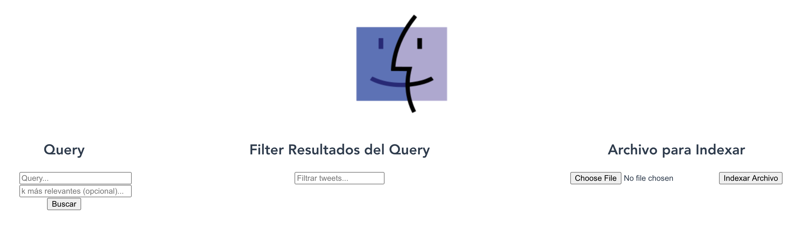
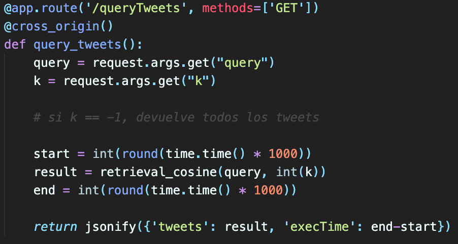
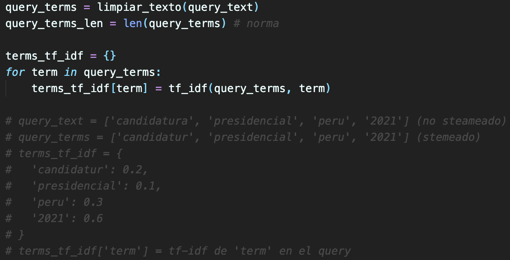
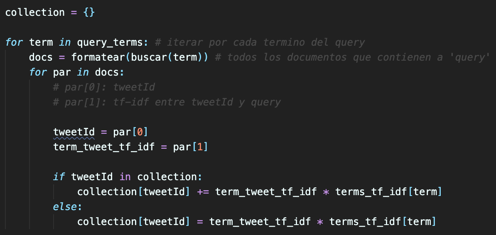
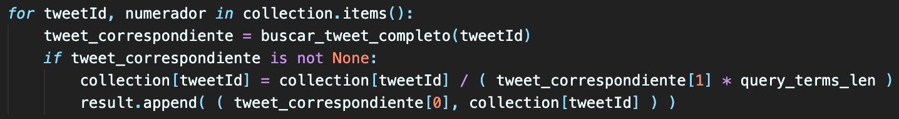

# Proyecto 2: Base de Datos 2

## Integrantes
* Rodrigo Céspedes
* Benjamin Diaz
* Gabriel Spranger

## Introducción
Este proyecto consiste en realizar un procesamiento de un conjunto de tweets, para posteriormente realizar una consulta de un query (e.g. “UTEC ciencia de la computación”) con el fin de retornar los tweets que tengan relación con el query. Esta página web tiene 3 funciones principales:
* **Indexar:** Cargar un archivo `.json` (tweets) para realizar el procesamiento y guardarlo en la base de datos.
* **Query:** Procesa una oración y devuelve los tweets más relevantes al query dado, además del tiempo que demoró en retornar los tweets. e.g. “UTEC ciencia de la computación” devolverá los tweets que hablen sobre UTEC y ciencia de la computación.
* **Filtro:** Recibe una oración y filtra a los tweets devueltos por la oración. Como un CTRL + F.

## Construcción del índice invertido
La construcción del índice invertido se hizo principalmente en dos etapas, la primera de ellas es el preprocesamiento que se tiene que hacer al archivo `.json` que contiene los tweets y la construcción en sí del índice invertido e índices auxiliares.
 
La primera parte consiste en parsear el json y filtrar los tweets que nos interesan indexar, específicamente para este experimento, nosotros no tomamos en cuenta los tweets que tenían el flag de ‘retweeted’ como verdadero. Se tomó como ID de documento (docID) el campo ‘id’ y como contenido del documento el campo ‘text’ de cada entrada del json. Esta primera parte del preprocesamiento se hace dentro de la función `read_json()`.  Luego, tenemos que filtrar el contenido del documento las palabras que nos interesa indexar, para esto se realiza una filtración donde se *tokenizan* los términos dentro del texto, se remueven los *stop words* y se realiza un stemming de las palabras resultantes, esta filtración se hace dentro de la función `limpiar_texto()`. Luego, todas estas se agregan al conjunto total de palabras de todos los tweets.

La siguiente parte consiste en construir el índice invertido, cada entrada de este índice deberá contener un término, seguido de una lista de pares, en el primer elemento del par se encuentra un docID donde se encuentra ese término y en el segundo elemento, su peso tf-idf correspondiente a dicho documento. Para cada uno de los elementos de la lista de términos totales se compara con todos los tweets y se revisa si existe dentro de dicho documento, si es así, se guarda el docID y además la cantidad de ocurrencias del término en ese texto. Con esos datos, se puede construir el índice con los respectivos pesos tf-idf. Luego, simplemente se guarda de manera ordenada por el docID en un archivo de texto.

Aparte de este índice, se crean de manera muy similar otros dos índices (índices auxiliares), que guardan el contenido de los tweets para ser buscados a partir del docID.

## Manejo de memoria secundaria

El manejo de memoria secundaria en realidad es bien sencillo, los índices se guardan en archivos de texto. Cabe recalcar que los índices diseñados para búsqueda binaria (índices auxiliares) fueron pensados con registros de longitud fija, para así poder acceder a cualquier registro de manera aleatoria. Además de dichos índices, también se guardaron un par de archivos extra que guardan exclusivamente tamaños de la colección de registros para los índices.

## Ejecución de las consultas

La ejecución de cada consulta empieza en el front. El usuario ingresa el query en lenguaje natural y elige (opcional) el número `k` que representa los `k` tweets más relevantes que el usuario quiere, de acuerdo a su búsqueda. Luego, cuando el usuario hace clic en `Buscar`, le mandamos un request al back para que procese la consulta (string) y devuelva los k más cercanos (si el usuario no pone un k, entonces se retornan todos los tweets que tienen similitud con el query). En cuanto al back, recibimos el query y el número k y se lo pasamos a la función `retrieval_cosine(query, k)` el cual retorna un array de diccionarios que representan los tweets que tienen similitud con el query del usuario. Además, medimos el tiempo de ejecución de la función `retrieval_cosine()`. Luego de esto, le retornamos al front un JSON que tiene el tiempo de ejecución de el procesamiento del query y el resultado del query.

En cuanto a la función `retrieval_cosine()`, lo primero que hacemos es normalizar cada término del query, para esto, llamamos a la función `limpiar_texto()`, la cual toma como parámetro un string y devuelve una lista de strings (un elemento por cada palabra) normalizados. Luego, obtenemos el peso tf-ifd de cada término en el query, ya que esto es necesario para obtener la similitud de coseno. 

Después, por cada término del query, buscamos ese término en el índice. Buscar el término en el índice, nos devuelve una lista de tuplas donde tupla[0] tiene el `tweetId` donde aparece ese término y tupla[1] el tf-ifd entre ese tweet y el término de búsqueda. Luego iteramos sobre esta lista. Mantenemos un hash que tiene como key el `tweetId` y como valor, el numerador de la similitud coseno. Al final de las iteraciones de los dos bucles anidados, por cada `tweetId`, `hash[tweetId]` tendrá el numerador de la similitud coseno entre ese tweet y el query. 

Luego, por cada tweetId, dividimos `hash[tweetId]` por la norma del tweet con ese `tweetId` multiplicado por la norma del query (`query_terms_len`), el cual ya habíamos calculado anteriormente. Luego de este proceso, por cada `tweetId`, `hash[tweetId]` tendrá la similitud coseno entre ese tweet y el query. Finalmente, mientras dividiamos cada entrada del hash por la norma correspondiente, insertabamos en una lista una tupla donde tupla[0] tiene el tweet entero y tupla[1] tiene la similitud coseno entre ese tweet y el query. Ordenamos la lista por la similitud coseno y retornamos los k primeros que se pasó como parámetro, pero si se pasó como parámetro k = -1, se devuelven todos los resultados.

## Instrucciones

### Front
* Entrar al carpeta **frontend**
* `npm install`
* Entrar a la carpeta src
* `npm run serve`

### Backend
* Entrar a la carpeta **backend**
* `python3 -m venv env`
* `source env/bin/activate`
* `pip install -r requirements.txt`
* `python3 app.py`
